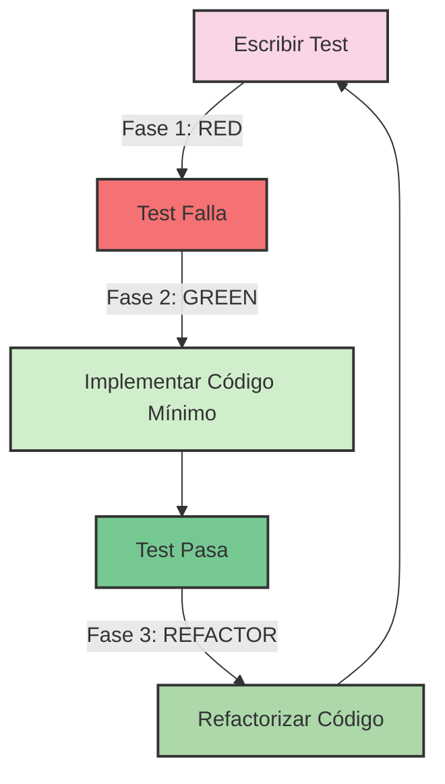
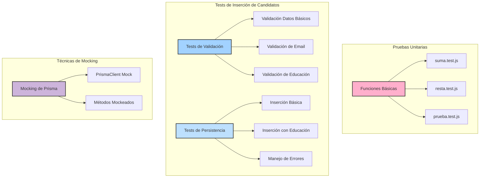
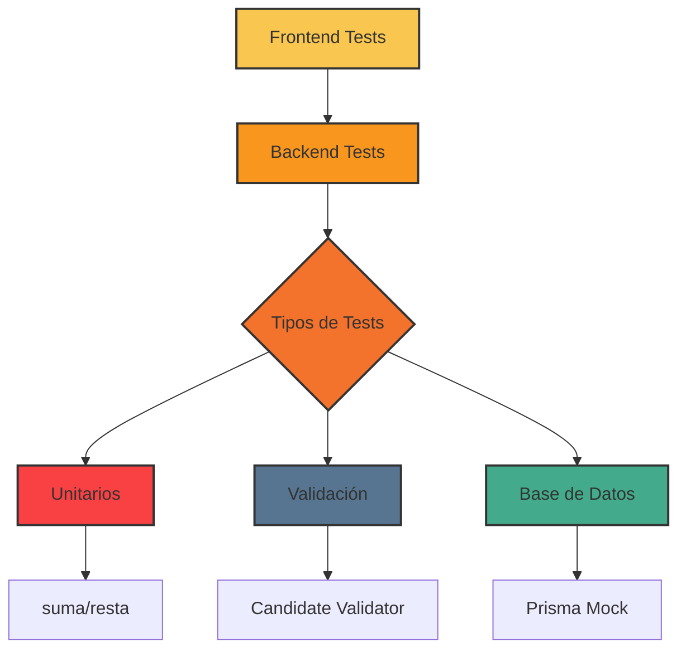
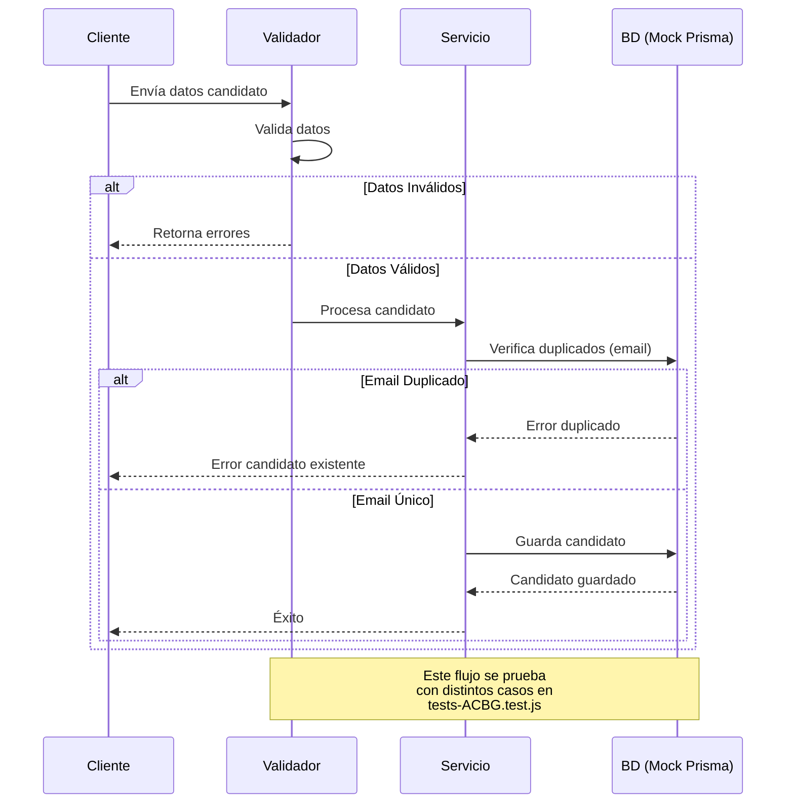
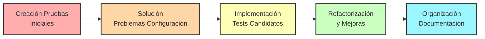
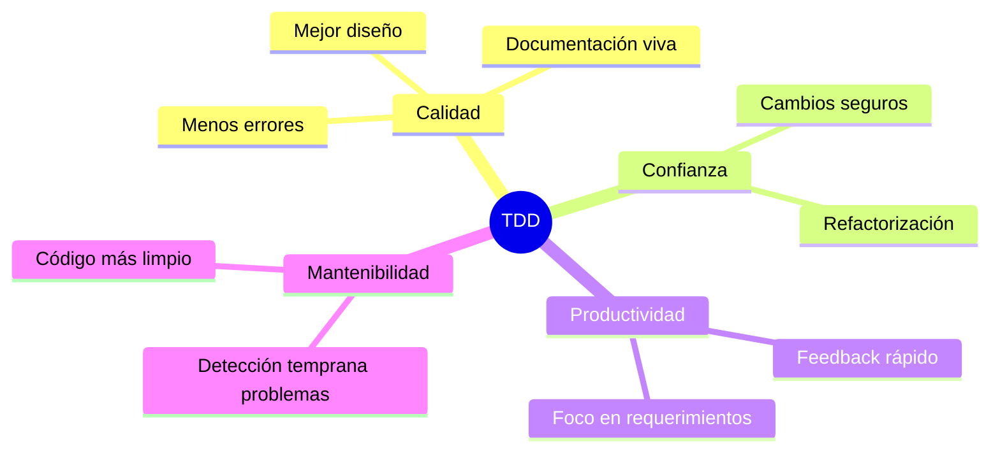

# Diagrama del Proceso TDD en el Proyecto

Este diagrama ilustra el flujo de trabajo del Desarrollo Dirigido por Pruebas (TDD) aplicado en nuestro proyecto.

Los diagramas incluidos muestran:
- El ciclo Red-Green-Refactor del TDD
- La estructura jerárquica de las pruebas implementadas
- La arquitectura del sistema de pruebas
- El flujo de los tests de inserción de candidatos
-Un mapa mental de los beneficios del TDD

## Ciclo TDD Aplicado

## Estructura de Nuestros Tests

## Arquitectura del Sistema de Pruebas

## Flujo de Tests de Inserción de Candidatos

## Adaptación TDD a Nuestro Proyecto

## Beneficios TDD en Nuestro Proyecto

