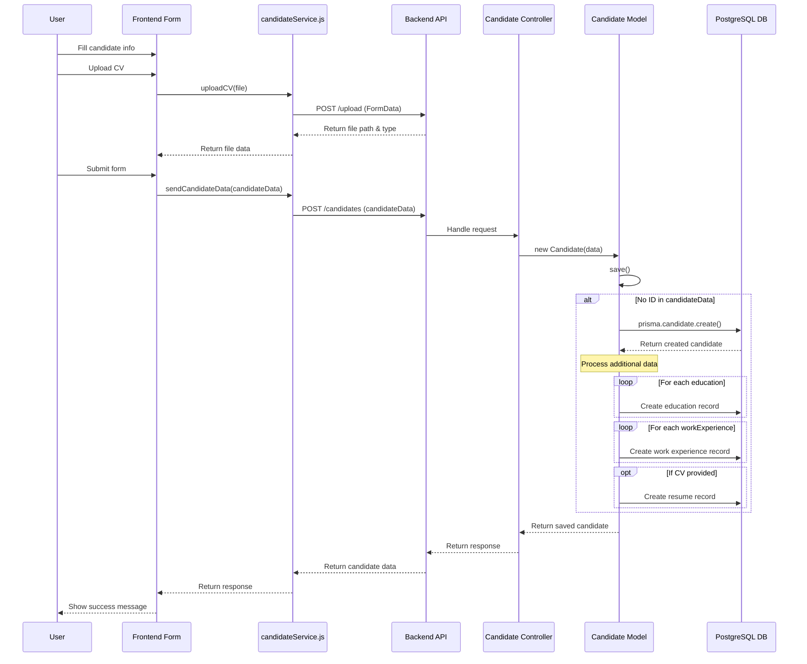

# Create New Candidate Sequence Diagram

```mermaid
sequenceDiagram
    participant User
    participant FrontendForm as Frontend Form
    participant CandidateService as candidateService.js
    participant API as Backend API
    participant CandidateController as Candidate Controller
    participant CandidateModel as Candidate Model
    participant Database as PostgreSQL DB

    User->>FrontendForm: Fill candidate info
    User->>FrontendForm: Upload CV
    FrontendForm->>CandidateService: uploadCV(file)
    CandidateService->>API: POST /upload (FormData)
    API-->>CandidateService: Return file path & type
    CandidateService-->>FrontendForm: Return file data
    
    User->>FrontendForm: Submit form
    FrontendForm->>CandidateService: sendCandidateData(candidateData)
    CandidateService->>API: POST /candidates (candidateData)
    API->>CandidateController: Handle request
    CandidateController->>CandidateModel: new Candidate(data)
    CandidateModel->>CandidateModel: save()
    
    alt No ID in candidateData
        CandidateModel->>Database: prisma.candidate.create()
        Database-->>CandidateModel: Return created candidate
        
        Note over CandidateModel: Process additional data
        
        loop For each education
            CandidateModel->>Database: Create education record
        end
        
        loop For each workExperience
            CandidateModel->>Database: Create work experience record
        end
        
        opt If CV provided
            CandidateModel->>Database: Create resume record
        end
    end
    
    CandidateModel-->>CandidateController: Return saved candidate
    CandidateController-->>API: Return response
    API-->>CandidateService: Return candidate data
    CandidateService-->>FrontendForm: Return response
    FrontendForm-->>User: Show success message
```
