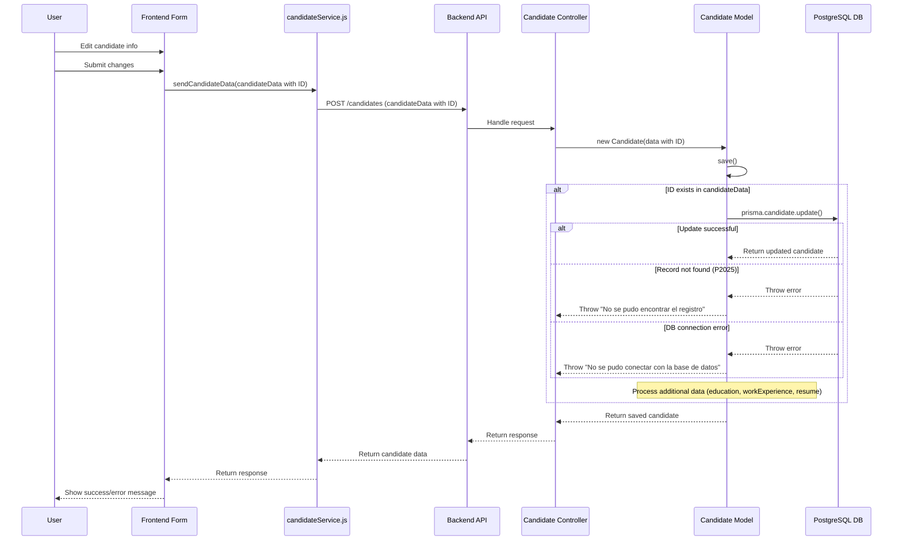

# Update Existing Candidate Sequence Diagram

```mermaid
sequenceDiagram
    participant User
    participant FrontendForm as Frontend Form
    participant CandidateService as candidateService.js
    participant API as Backend API
    participant CandidateController as Candidate Controller
    participant CandidateModel as Candidate Model
    participant Database as PostgreSQL DB

    User->>FrontendForm: Edit candidate info
    User->>FrontendForm: Submit changes
    FrontendForm->>CandidateService: sendCandidateData(candidateData with ID)
    CandidateService->>API: POST /candidates (candidateData with ID)
    API->>CandidateController: Handle request
    CandidateController->>CandidateModel: new Candidate(data with ID)
    CandidateModel->>CandidateModel: save()
    
    alt ID exists in candidateData
        CandidateModel->>Database: prisma.candidate.update()
        
        alt Update successful
            Database-->>CandidateModel: Return updated candidate
        else Record not found (P2025)
            Database-->>CandidateModel: Throw error
            CandidateModel-->>CandidateController: Throw "No se pudo encontrar el registro"
        else DB connection error
            Database-->>CandidateModel: Throw error
            CandidateModel-->>CandidateController: Throw "No se pudo conectar con la base de datos"
        end
        
        Note over CandidateModel: Process additional data (education, workExperience, resume)
    end
    
    CandidateModel-->>CandidateController: Return saved candidate
    CandidateController-->>API: Return response
    API-->>CandidateService: Return candidate data
    CandidateService-->>FrontendForm: Return response
    FrontendForm-->>User: Show success/error message
```
